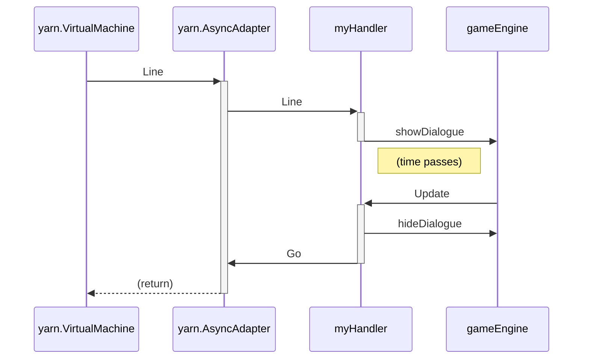

# yarn

A Go implementation of parts of Yarn Spinner 2.3.

[](https://buildkite.com/drjosh9000/yarn)
[](https://pkg.go.dev/github.com/DrJosh9000/yarn)
[](https://goreportcard.com/report/github.com/DrJosh9000/yarn)
[](https://github.com/DrJosh9000/yarn/blob/main/LICENSE)

The yarn package is a Go implementation of the
[Yarn Spinner 2.0](https://github.com/YarnSpinnerTool/YarnSpinner) dialogue
system. Given a compiled `.yarn` file (into the VM bytecode and string table)
and `DialogueHandler` implementation, the `VirtualMachine` can execute the
program as the original Yarn Spinner VM would, delivering lines, options, and
commands to the handler.

## Supported features

* ✅ All Yarn Spinner 2.0 machine opcodes, instruction forms, and standard
     functions.
* ✅ Custom functions, similar to the `text/template` package.
* ✅ Yarn Spinner CSV string tables.
* ✅ String substitutions (`Hello, {0} - you're looking well!`).
* ✅ `select` format function (`Hey [select value={0} m="bro" f="sis" nb="doc"]`).
* ✅ `plural` format function (`That'll be [plural value={0} one="% dollar" other="% dollars"]`).
* ✅ `ordinal` format function (`You are currently [ordinal value={0} one="%st" two="%nd" few="%rd" other="%th"] in the queue`).
  * ✅ ...including using Unicode CLDR for cardinal/ordinal form selection
    (`en-AU` not assumed!)
* ✅ Custom markup tags are also parsed, and rendered to an `AttributedString`.
* ✅ `visited` and `visit_count`
* ✅ Built-in functions like `dice`, `round`, and `floor` that are mentioned in the Yarn Spinner documentation.

## Basic Usage

1. Compile your `.yarn` file. You can probably get the compiled output from a
   Unity project, or you can compile without using Unity with a tool like the
   [Yarn Spinner Console](https://github.com/YarnSpinnerTool/YarnSpinner-Console):

   ```shell
   ysc compile Example.yarn
   ```

   This produces two files: the VM bytecode `.yarnc`, and a string table
   `.csv`.

2. Implement a `DialogueHandler`, which receives events from the VM. Here's an
   example that plays the dialogue on the terminal:

   ```go
   type MyHandler struct{
       stringTable *yarn.StringTable
       // ... and your own fields ...
   }

   func (m *MyHandler) Line(line yarn.Line) error {
       // StringTable's Render turns the Line into a string, applying all the
       // substitutions and format functions that might be present.
       text, _ := m.stringTable.Render(line)
       fmt.Println(text)
       // You can block in here to give the player time to read the text.
       fmt.Println("\n\nPress ENTER to continue")
       fmt.Scanln()
       return nil
   }

   func (m *MyHandler) Options(opts []yarn.Option) (int, error) {
       fmt.Println("Choose:")
       for _, opt := range opts {
           text, _ := m.stringTable.Render(opt.Line)
           fmt.Printf("%d: %s\n", opt.ID, text)
       }
       fmt.Print("Enter the number of your choice: ")
       var choice int
       fmt.Scanln(&choice)
       return choice, nil
   }

   // ... and also the other methods.
   // Alternatively you can embed yarn.FakeDialogueHandler in your handler.
   ```

3. Load the two files, your `DialogueHandler`, a `VariableStorage`, and any
   custom functions, into a
   `VirtualMachine`, and then pass the name of the first node to `Run`:

   ```go
   package main

   import "github.com/DrJosh9000/yarn"

   func main() {
       // Load the files (error handling omitted for brevity):
       program, stringTable, _ := yarn.LoadFiles("Example.yarn.yarnc", "en-AU")

       // Set up your DialogueHandler and the VirtualMachine:
       myHandler := &MyHandler{
           stringTable: stringTable,
       }
       vm := &yarn.VirtualMachine{
           Program: program,
           Handler: myHandler,
           Vars:    yarn.NewMapVariableStorage(), // or your own VariableStorage implementation
           FuncMap: yarn.FuncMap{ // this is optional
               "last_value": func(x ...any) any {
                   return x[len(x)-1]
               },
               // or your own custom functions!
           }
       }

       // Run the VirtualMachine starting with the Start node!
       vm.Run("Start")
   }
   ```

See `cmd/yarnrunner.go` for a complete example.

## Async usage

To avoid the VM delivering the lines, options, and commands all at once,
your `DialogueHandler` implementation is allowed to block execution of the VM
goroutine - for example, using a channel operation.

However, in a typical game, each line or option would be associated with two
distinct operations: showing the line/option to the player, and hiding it later
on in response to user input.

To make this easier, `AsyncAdapter` can handle blocking the VM for you.



Use
`AsyncAdapter` as the `VirtualMachine.Handler`, and create the `AsyncAdapter`
with an `AsyncDialogueHandler`:

```go
// MyHandler should now implement yarn.AsyncDialogueHandler.
type MyHandler struct {
    stringTable *yarn.StringTable

    dialogueDisplay Component

    // Maintain a reference to the AsyncAdapter in order to call Go on it
    // in response to user input.
    // (It doesn't have to be stored in the handler, there are probably better
    // places in a real project. This is just an example.)
    asyncAdapter *yarn.AsyncAdapter
}

// Line is called by AsyncAdapter from the goroutine running VirtualMachine.Run.
// The AsyncAdapter pauses the VM.
func (m *MyHandler) Line(line yarn.Line) {
    text, _ := m.stringTable.Render(line)
    m.dialogueDisplay.Show(text)
}

// Update is called on every tick by the game engine, which is a separate
// goroutine to the one the Yarn virtual machine is running in.
func (m *MyHandler) Update() error {
    //...

    if m.dialogueDisplay.Visible() && inpututil.IsKeyJustPressed(ebiten.KeyEnter) {
        // Hide the dialogue display.
        m.dialogueDisplay.Hide()

        // Calling AsyncAdapter.Go un-pauses the VM.
        m.asyncAdapter.Go()
    }
    //...
}

// --- Setup ---

myHandler := &MyHandler{}
myHandler.asyncAdapter = yarn.NewAsyncAdapter(myHandler)

vm := &yarn.VirtualMachine{
    Program: program,
    Handler: myHandler.asyncAdapter,
    ...
}
```

## Usage notes

Note that using an earlier Yarn Spinner compiler will result in some unusual
behaviour when compiling Yarn files with newer features. For example, with v1.0
`<<jump ...>>` may be compiled as a command. Your implementation of `Command`
may implement `jump` by calling the `SetNode` VM method.

If you need the tags for a node, you can read these from the `Node` protobuf
message directly. Source text of a `rawText` node can be looked up manually:

```go
prog, st, _ := yarn.LoadFiles("testdata/Example.yarn.yarnc", "en")
node := prog.Nodes["LearnMore"]
// Tags for the LearnMore node:
fmt.Println(node.Tags)
// Source text string ID:
fmt.Println(node.SourceTextStringID)
// Source text is in the string table:
fmt.Println(st.Table[node.SourceTextStringID].Text)
```

## Licence

This project is available under the Apache 2.0 license. See the `LICENSE` file
for more information.

The `bytecode` and `testdata` directories contains files or derivative works
from Yarn Spinner. See `bytecode/README.md` and `testdata/README.md` for more
information.
